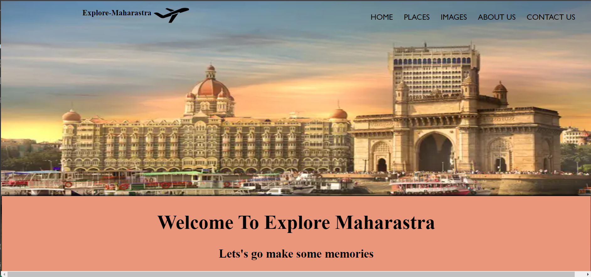

# Explore-Maharastra ✈️🌍

### Description 

 
Explore Maharashtra Project is an initiative aimed at promoting the tourism potential of Maharashtra, a state located in western India. Maharashtra is known for its diverse culture, rich heritage, and numerous natural attractions that draw tourists from all over the world.
The project aims to showcase the various tourist destinations in Maharashtra and highlight the unique experiences that visitors can enjoy in the state. It will cover the major cities of Maharashtra such as Mumbai, Pune, and Nagpur, and also explore the lesser-known towns and villages that offer a glimpse into the traditions and customs of the state.
The project will feature a range of activities and experiences, including heritage walks, culinary tours, adventure sports, wildlife safaris, cultural festivals, and more. It will also provide information about the best accommodations, transportation options, and local services to help visitors plan their trips to Maharashtra.
Through the Explore Maharashtra Project, visitors will be able to discover the state’s wealth of attractions and gain a deeper appreciation of its people, traditions, and history. The project will serve as a valuable resource for anyone interested in exploring the cultural and natural beauty of this vibrant state.

## Contribute By:-

